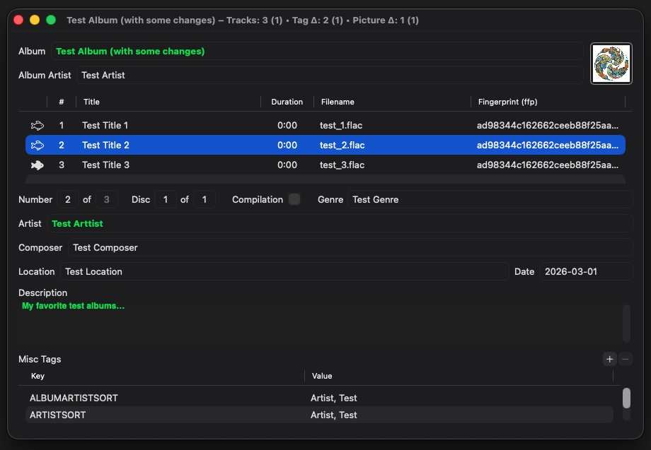
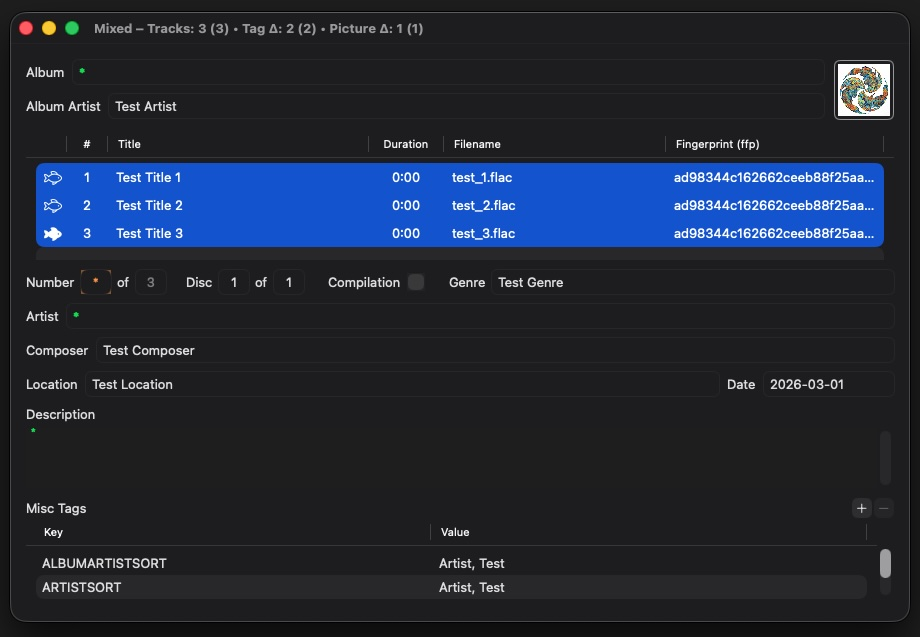
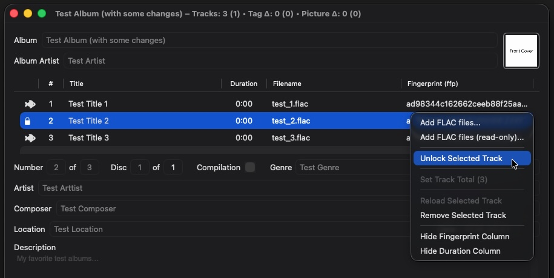
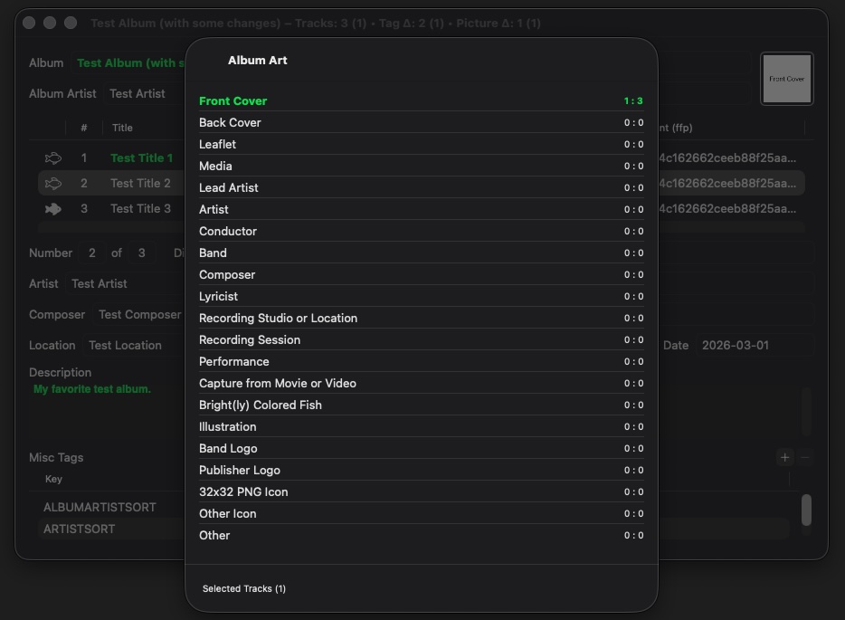
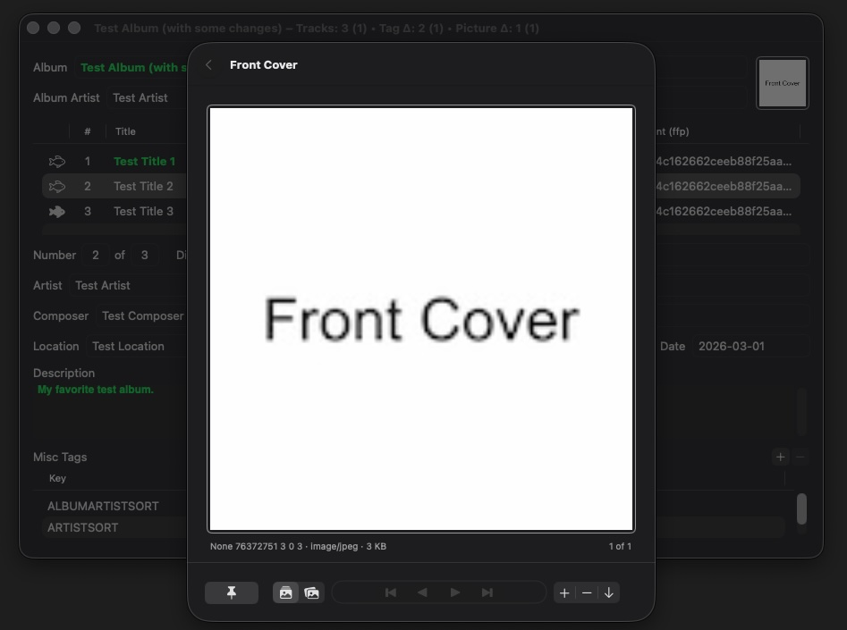
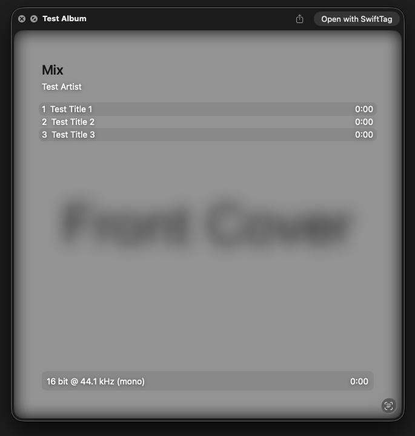
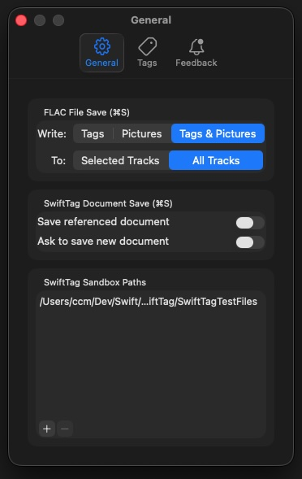
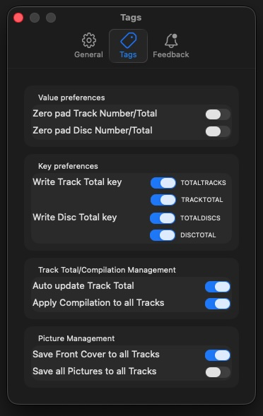
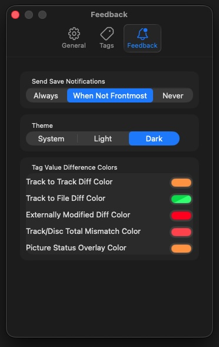

# SwiftTag

This README is available/rendered at the 
[SwiftTag GitHub repository](https://github.com/chrismccready/swifttag)
where documentation links are rendered by the GitHub repository site as code and 
at the [SwiftTag GitHub Pages site](https://chrismccready.github.io/swifttag/Docs/)
where documentation links are rendered as an html web page (unless referencing the 
location of code files directly). The content is identical.

SwiftTag is a macOS SwiftUI app for editing [FLAC](https://xiph.org/flac/) 
metadata. It is built as a focused scriptable desktop tagging utility, not a 
media library manager: load FLAC files, edit tags and embedded pictures across 
one or more tracks, inspect differences, then write chosen changes back to 
source files or save the editor state as a `.swifttag` session document. 
[SwiftTag documentation](UserDocumentation/index.html) is also available in built 
SwiftTag app via Help menu.

Current project target: macOS 26.2 or later.

## Developed by OI guiding AI (Spring 2026: GPT-5.3, 5.4, 5.5)
One of the primary goals of this project was to use AI to develop a SwiftUI
application that has at least a moderate level of complexity: UI, internal and 
external file/document state management, Quick Look, User Notifications, 
AppleScript scriptability, documentation and of course actual usefulness.  

See [SwiftTag GitHub Pages](https://chrismccready.github.io/swifttag/) for a 
full analysis of project development using AI, including analysis metrics and
generation process.

Initial development was done using Xcode Assistant in a pre-release of Xcode 
26.3. Some initial Assistant exchange transcripts were lost due to early Xcode 
release limitations and my learning curve. However, the loses were few and 
essentially all human/agent interactions for the project are available at
[Docs/Plans/Transcripts](https://github.com/chrismccready/swifttag/tree/main/Docs/Plans/Transcripts). 
Since late march, the [Codex App](https://developers.openai.com/codex/app) has been used for most
development and occasionally Copilot in VSCode. The AI models used were GPT-5.3
(Codex 5.3), GPT-5.4, and GPT-5.5 with reasoning set to High or Very High
usually the latter.   

The development process usually follows prompting the agent to create a
[Plan](https://github.com/chrismccready/swifttag/tree/main/Docs/Plans), 
reviewing the plan and tweaking as needed, and then 
implementation. Almost no code was written by a human, but as can be seen in 
the transcripts, there is continuous guidance, review, and yet more guidance. 
The [Guides](https://github.com/chrismccready/swifttag/tree/main/Docs/Guides) 
folder contains AI agent guides/rules beyond 
AGENTS.md. There are some transcripts there as well - getting the basic dev 
cycle (including tests) was/is an ongoing thing.

## SwiftTag Features

Core workflows:

- [Add FLAC files](UserDocumentation/workflows/adding-flac-files.html) or 
  folders through the File menu, drag and drop, Finder open, or AppleScript.
- [Edit](UserDocumentation/workflows/tags.html) selected-track fields, 
  common core tags, and custom FLAC/Ogg Vorbis comment keys.
- [Show track status](UserDocumentation/workflows/status-and-diffs.html), 
  track number, title, filename, optional duration, and optional FLAC 
  fingerprint columns.
- Format track-to-track, track-to-file, externally modified, total mismatch,
  and duplicate-picture differences with configurable visual cues.
- Detect unsaved editor changes, missing source files, and external differences
  when source FLAC files change outside SwiftTag.
  
- Batch edit from table selection; selected tracks are the source of truth for
  multi-track edits and selected-track save scope.
  
- Add files normally or as read-only locked tracks; locked tracks stay visible
  but are skipped by FLAC writeback.
- Toggle selected track locks, set track totals, reload selected tracks from
  disk, and remove selected tracks from the editor.
  
- Append to the current editor or replace the current track list, with
  confirmation for destructive replacement.
- [Manage embedded FLAC pictures](UserDocumentation/workflows/pictures.html) 
  across all FLAC picture record types, including front cover, back cover, 
  leaflet, media, artist, composer, logo, icon, and other picture categories.
  
- Import, remove, export, copy, paste, pin, and scope picture records through
  the Picture Browser.
- Edit picture descriptions and derive MIME type, dimensions, depth, and color
  count from imported JPEG/PNG data.
  
- [Save](UserDocumentation/workflows/saving.html) tags only, pictures only, or 
  tags and pictures together.
- Save either selected tracks or all loaded unlocked tracks, according to the
  current command and settings.
- Save and reopen 
  [`.swifttag` session documents](UserDocumentation/workflows/swifttag-documents.html) 
  that preserve track references, security-scoped bookmarks when available, tags, 
  pictures, audio metadata, and document metadata.
- Preview `.swifttag` documents in Finder Quick Look.

- Use [AppleScript](UserDocumentation/automation/applescript.html) to 
  inspect/edit windows/documents/tracks/tags/pictures, add files, create or 
  delete items, save with explicit scope and payload, close windows, open 
  settings, and quit.
- Open bundled HTML help from Help > [SwiftTag Help](UserDocumentation/index.html).

## SwiftTag Settings

SwiftTag has separate save paths for FLAC writeback and `.swifttag` session
documents.

- `Save` writes FLAC files using General settings for payload and scope.
- `Save Tags` writes tag payload only, using current save scope.
- `Save Pictures` writes picture payload only, using current save scope.
- `Save SwiftTag Document...` writes a `.swifttag` package and does not, by
  itself, rewrite source FLAC files.  

[General settings](UserDocumentation/workflows/settings.html#general) control command-S behavior and sandbox permission paths:  

[Tag settings](UserDocumentation/workflows/settings.html#tags) control write formatting and propagation:  

[Feedback settings](UserDocumentation/workflows/settings.html#feedback) control Notifications, Theme and Diff formatting:  

## SwiftTag Documents

`.swifttag` files are package documents. They store editor session state rather
than acting as FLAC files.

Saved document contents include:

- document id, version, package fingerprint, and SwiftTag metadata
- track source file URL and file bookmark data when available
- FLAC fingerprint, duration, sample rate, total samples, bit depth, and channel
  count
- tag dictionaries
- picture records and pooled picture assets

SwiftTag can open `.swifttag` documents from the File menu, Finder, or
AppleScript. Reopened sessions restore saved editor state and compare against
current source FLAC files when access is available.

Finder Quick Look renders a document preview from saved package contents,
including album information, ordered track rows, durations, audio summary, and a
front-cover background when present.

## User Documentation

Bundled user docs live under `Docs/UserDocumentation/` and are copied into the
app bundle and are available in the built app via the Help menu.

See [User Documentation index](UserDocumentation/index.html).

## Project: Build And Test

Open `SwiftTag.xcodeproj` in Xcode.

- Build: Product > Build
- Run app: Product > Run
- Run tests: Product > Test

Project dependencies are vendored in `ThirdParty/`:

- [`ThirdParty/flac/`](https://github.com/xiph/flac)
  Xiph.Org FLAC reference implementation. SwiftTag uses libFLAC through its
  local FLAC bridge to read and write tags, pictures, stream info,
  fingerprints, and durations.
- [`ThirdParty/ViewInspector/`](https://github.com/nalexn/ViewInspector)
  SwiftUI inspection library used by SwiftTag tests for view hierarchy, state,
  and interaction assertions.

No separate package fetch is required for normal Xcode build/test use; the
checked-in `ThirdParty/` sources are the project dependency source of truth.

The active test plan includes:

- `SwiftTagTests`
- `SwiftTagUITests`

Additional test and development fixtures:

- `SwiftTagTestFiles/` contains FLAC and image fixtures used by unit, service,
  UI, document, Quick Look, and manual verification workflows.
- `SwiftTagAppleScriptTests/` contains AppleScript-focused test support used by
  targeted automation verification.

Prefer targeted tests over full-suite runs during development. For SwiftUI state
and behavior, prefer ViewInspector where practical. Reserve UI tests for
end-to-end app integration that needs the running app, menus, windows, or
AppleScript harness behavior.

## Project: Main App Areas

- `SwiftTag/SwiftTagApp.swift`
  App entry point, document-open routing, commands, settings scene, Diff Tools
  utility window, AppleScript registration, and save/notification setup.
- `SwiftTag/ContentView.swift`
  Main editor host. Coordinates imports, saves, `.swifttag` document flows,
  sheets, alerts, monitors, focused commands, and view model wiring.
- `SwiftTag/Features/TagEditor/`
  Album fields, track table, core tags, misc tags, selection-driven editing,
  diff formatting, lock/reload/remove commands, and drag-and-drop import.
- `SwiftTag/Features/AlbumArt/`
  Front-cover quick edit, Picture Browser, picture type navigation, import,
  export, copy/paste, pinning, scoping, metadata display, and description edit.
- `SwiftTag/Features/FlacImport/`
  Mapping between FLAC service records and editable Swift models, plus write
  mapping for tag and picture save operations.
- `SwiftTag/Features/Settings/`
  General save settings, tag write settings, feedback settings, sandbox paths,
  and Diff Tools UI.
- `SwiftTag/Shared/Models/`
  Track, tag, misc-tag, save, feedback, sandbox, status, and editor-session
  model types.
- `SwiftTag/Shared/Utilities/`
  Document package read/write support, file monitors, sandbox bookmark access,
  AppleScript support, save notifications, unsaved-change coordination, tag
  normalization, diff formatting, duration/date formatting, and help opening.
- `SwiftTag/Shared/QuickLook/`
  `.swifttag` Quick Look snapshot, SwiftUI preview view, layout, and bitmap
  renderer.
- `SwiftTag/FlacMetadataService.swift`
  Swift service wrapper around the FLAC bridge for reading/writing tags,
  pictures, stream info, fingerprint, and duration.
- `SwiftTag/SwiftTag.sdef`
  AppleScript terminology for application settings, windows, documents, tracks,
  tags, pictures, enumerations, and commands.
- `SwiftTagQuickLookPreview/`
  Quick Look preview extension target.
- `ThirdParty/flac/`
  libFLAC source used by the FLAC bridge.
- `ThirdParty/ViewInspector/`
  ViewInspector dependency used by SwiftUI-focused tests.

## Project: AI Context Important

This section is intentionally reserved for high-signal project context that
should remain easy for both humans and AI tooling to find quickly.

- Primary project instructions live in `AGENTS.md`.
- Guides live under `Docs/Guides/`.
- Plans live under `Docs/Plans/`.
- User-facing docs live under `Docs/UserDocumentation/`.
- Apple documentation lookup guidance and the local Apple docs index live under
  `Docs/AppleDocsIndex/`.
- Historical transcripts live under `Docs/Plans/Transcripts/` and should not be
  treated as implementation source of truth unless explicitly requested.
- This README should describe implemented behavior, not planned behavior.
- Latest numbered implementation plan at time of this update:
  `Docs/Plans/29-AddSandboxSettings.md`.
- Numbered plans currently cover:
  - `1-FLACBridgeExecution.md`
  - `2-ContentViewReorganizationPlan.md`
  - `3-FlacPictureImportAlbumArtPlan.md`
  - `4-FlacWriteTagsAndPicturesPlan.md`
  - `5-AddSaveNotificationsPlan.md`
  - `6-AgentsTranscriptSkillPlan.md`
  - `7-AddSaveStatusViewPlan.md`
  - `8-AddTrackStatusPlan.md`
  - `9-AddUIFeedbackSettings.md`
  - `10-AddTrackManagement.md`
  - `11-v1-AddMultiPicturePerTrackSupport.md`
  - `11-v2-AddMultiPicturePerTrackSupport.md`
  - `11-v3-AddMultiPicturePerTrackSupport.md`
  - `11-v4-AddMultiPicturePerTrackSupport.md`
  - `12-AddFLACDocumentOpenSupport.md`
  - `13-AddFLACFingerprintSupport.md`
  - `14-AddCompilationTag.md`
  - `15-AddSwiftTagDocumentCreation.md`
  - `16-AddSwiftTagDocumentRead.md`
  - `17-SwiftTagDocumentReadLiveFileResolution.md`
  - `18-UpdateWindowTitleText.md`
  - `19-AddSwiftTagDocumentSaveOptions.md`
  - `20-AddSwiftTagDocumentSaveOptions.md`
  - `21-AddSwiftTagDocumentBookmark.md`
  - `22-AddSwiftTagDocumentSaveOptions.md`
  - `23-AddSwiftTagDocumentQuickLook.md`
  - `24-AddTrackDurationInfo.md`
  - `25-AddPictureDescriptionEdit.md`
  - `26-AddAppleScriptSupport.md`
  - `27-TrackTagsRefactor.md`
  - `28-AddSwiftTagUseDocumentation.md`
  - `29-AddSandboxSettings.md`
- When adding or completing future numbered plans, update this README if current
  behavior or the latest-plan pointer changes.
